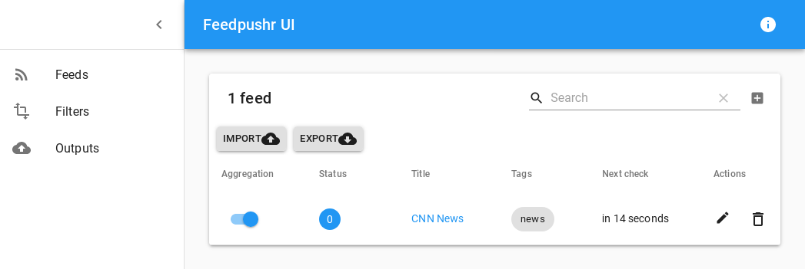

+++
title = "RSS feed with feedpushr"
description = "Use feedpushr to integrate RSS feeds"
weight = 2
+++


[Feedpushr](https://github.com/ncarlier/feedpushr) is a powerful open source RSS feed aggregator able to process and send articles to third party services.
And among these services, we have readflow.

## Start Feedpushr

To execute Feedpushr you have several possibilities:

Use [Go](https://golang.org/) to compile and install the binary:

```bash
$ go get -v github.com/ncarlier/feedpushr
$ feedpushr --log-pretty --log-level debug
```

Or download the binary from the [source repository](https://github.com/ncarlier/feedpushr/releases):

```bash
$ sudo curl -s https://raw.githubusercontent.com/ncarlier/feedpushr/master/install.sh | bash
$ feedpushr --log-pretty --log-level debug
```

Or use [Docker](https://www.docker.com):

```bash
$ docker run -d --name=feedpushr ncarlier/feedpushr feedpushr --log-pretty --log-level debug
```

You can also launch Feedpushr in "desktop mode" by clicking on the `feedpushr-agent` executable. Feedpushr will then be accessible from an icon in your taskbar.

## Configure Feedpushr

You should be able to access the [Feedpushr Web UI](http://localhost:8080/ui/) :



Go to the `Outputs` configuration page:


Click on the `+` button to add an output and choose the readflow component.

Configure the component as follows:

- `Alias`: Enter a short description (ex: `To my readflow`).
- `URL`: Leave this field blank to use https://readflow.app or enter the API URL if you are using another instance.
- `API KEY`: Enter the [incoming webhook](../../incoming-webhook) token.


Activate the new output:


You can then import your OPML subscriptions into Feedpushr and see new articles in readflow.
