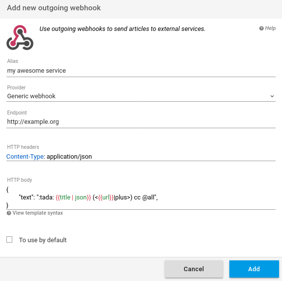

+++
title = "Generic webhook"
description = "Send articles to a generic webhook"
weight = 1
+++


A generic webhook is a simple HTTP access point using POST.

You can customize the webhook call by specifying the headers and body content of the HTTP request.

## Headers

By default readflow setup the content type:

```http
Content-Type: application/json
```

You can modify or add your own headers. Ex:

```http
Content-Type: text/plain
X-API-Key: 5ebe2294ecd0e0f08eab7690d2a6ee69
```

## The body

By default, the article is sent in JSON according to the following format:

```json
{
  "title": "The title",
  "text": "Text content (the summary)",
  "html": "HTML content",
  "href": "URL on readflow",
  "url": "Origin URL",
  "image": "Illustration URL",
  "published_at": "Publication date"
}
```

> If the content is empty, readflow forces the `Content-Type` to `application/json`.

It is possible to customize the content via a template.

### Templating

The template engine is very simple and allows to manipulate the properties of the article:

- `{{title}}`: The title
- `{{text}}`: Text content
- `{{html}}`: HTML contenu
- `{{href}}`: URL on readflow
- `{{url}}`: Origin URL
- `{{image}}`: Illustration URL
- `{{published_at}}`: Publication date

It is also possible to modify a property with a filter function:

- `{{ title | json }}`: JSON value escaping
- `{{ title | urlquery }}`: URL value escaping
- `{{ title | bas64 }}`: base 64 encoding

Example:

```django
{
	"text": ":tada: {{title | json}} (<{{url}}|more>) cc @all",
}
```

## Kinematics

To add a generic webhook, you must[configure your outgoing webhook](https://readflow.app/settings/integrations):


Click on the `Add` button to add an outgoing webhook.
The outgoing webhook creation page opens:



1. Enter an alias
1. Choose `generic` as provider
1. Configure the webhook URL
1. Configure HTTP headers
1. Customize the HTTP request body as needed
1. Click on the checkbox if you want to make it your default service

Once configured, you will see a new entry in the context menu of the article:


You can now send an article to a HTTP endpoint.
