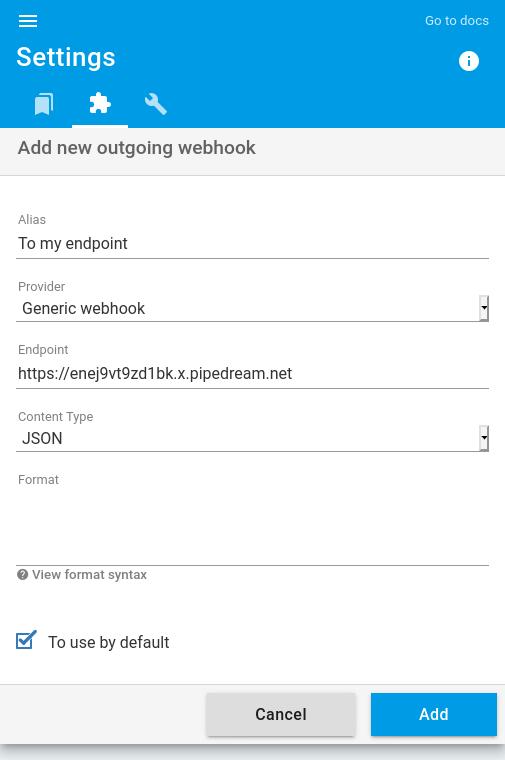

+++
title = "Generic webhook"
description = "Send articles to a generic webhook"
weight = 1
+++


A generic webhook is a simple HTTP access point using POST.

## Format

By default, the article is sent as a JSON with the following format:

```json
{
  "title": "The title",
  "text": "Text content (the summary)",
  "html": "HTML content",
  "url": "origin URL of the article",
  "image": "URL of the article illustration",
  "published_at": "article publication date"
}
```

It is possible to personalize the content sent.

You can specify its type:

- JSON
- HTML
- or Text

And you can specify its format using the [Golang templates](https://golang.org/pkg/text/template/) syntax.

To make it simple, you can access the JSON document properties above but prefix them with a dot and a capital letter between two brackets.
For example, the `title` property can be accessed with the `{{.Title}}` syntax.

## Kinematics

To add a generic webhook, you must[configure your outgoing webhook](https://readflow.app/settings/integrations):


Click on the `Add` button to add an outgoing webhook.
The outgoing webhook creation page opens:



1. Enter an alias
1. Choose `generic` as provider
1. Configure the webhook URL
1. Click on the checkbox if you want to make it your default service

Once configured, you will see a new entry in the context menu of the article:


You can now send an article to a HTTP endpoint.
