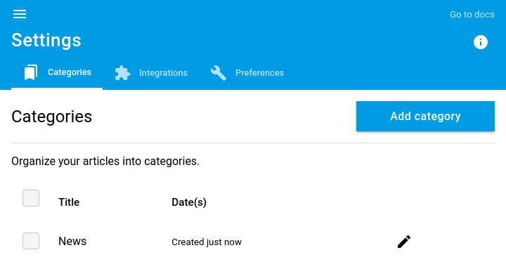

+++
title = "Catégories"
description = "Utiliser les catégories pour organiser vos flux de lecture"
weight = 2
+++

Dans readflow vous pouvez scinder vos flux de lectures en catégories.
L'ajout d'un article dans une catégorie dépend des règles que vous avez configurées.

## Catégories

Pour gérer les catégories, allez sur [l'écran de configuration](https://readflow.app/settings/categories):



Vous pouvez ajouter une catégorie en cliquant sur le bouton `Add category`.


Une catégorie est un simple titre et une règle d'affectation.

## Règle

Lors de l'ajout d'un article, le moteur de règle va entrer en action et appliquer les règles selon l'ordre des catégories.
A la première règle validée, l'article est placé dans la catégorie cible.
Si aucune règle ne matche alors l'article n'aura pas de catégorie.

La définition d'une règle est un pseudo code dont le résultat doit être vrai ou faux.

Au sein de la règle il est possible de faire référence à certains attributs:

- `title`: le titre de l'article
- `text`: le text (résumé) de l'article
- `url`: l'URL d'origine de l'article
- `tags`: les tags de l'article en entrée
- `webhook`: l'alias du webhook entrant utilisé

### La syntaxe

#### Les opérateurs

- `==` (égal)
- `!=` (non égal)
- `matches` (valide une expression régulière)
- `not ("foo" matches "bar")` (ne valide pas une expression régulière)

#### Les opérateurs logiques

- `not` ou `!` (non)
- `and` ou `&&` (et)
- `or` ou `||` (ou)

#### Les autres opérateurs

- `~` (concatenation)
  *Exemple:* `'Harry' ~ ' ' ~ 'Potter'` donnera `Harry Potter`
- `in` (contient)
- `not in` (ne contient pas)
  *Exemple:* `webhook in ["test", "bookmarklet"]`

#### Les fonctions

- `len` (longueur de la chaine de caractères)
   *Exemple:* `len(Text) >= 0`

### Exemples:

Classer les articles dont le webhook entrant est "foo":

```js
webhook == "foo"
```

Classer les articles dont le webhook entrant est "foo" ou "bar":

```js
webhook == "foo" || webhook == "bar"
// Peut aussi s'écrire:
webhook in ["foo", "bar"]
```

Classer les articles avec "foo" en tag:

```js
"foo" in tags
```

Classer les articles dont le titre contient "Amazon" et "Alexa":

```js
title matches "Amazon" and title matches "Alexa"
```

Classer les articles qui viennent de CNN:

```js
url matches "^https://edition.cnn.com"
```
